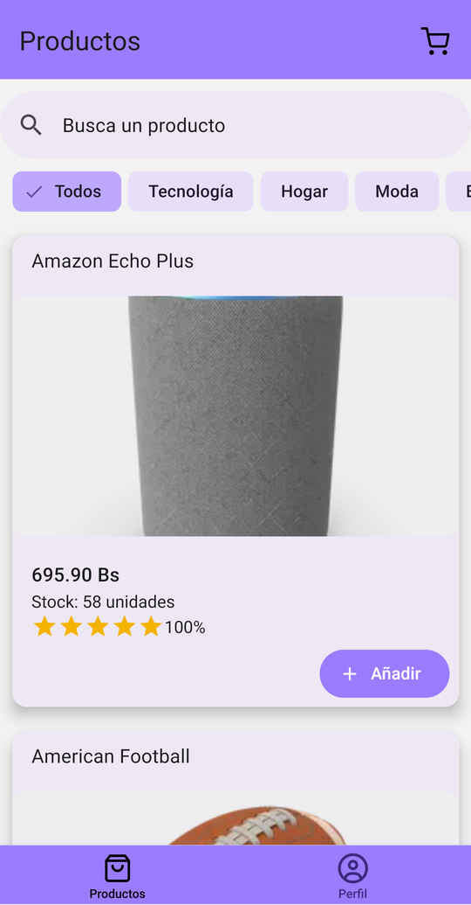
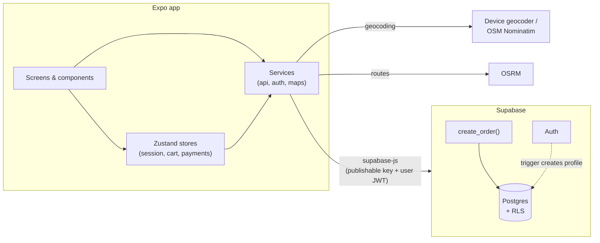
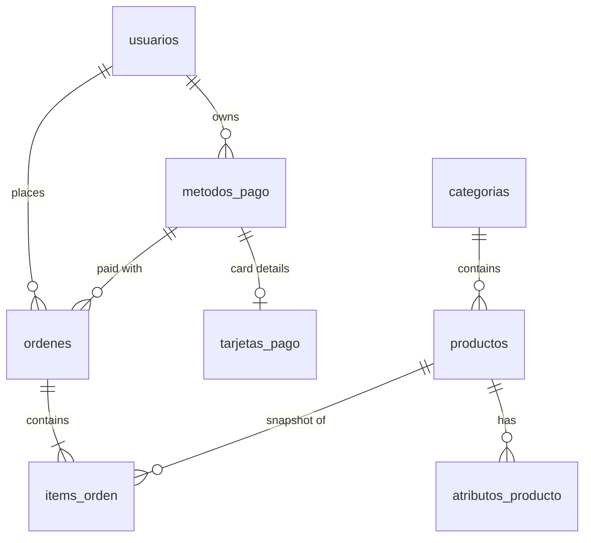

# CompraYa

[](.github/workflows/ci.yml)


**CompraYa** is a cross-platform mobile shopping app built with **Expo / React Native** and **Supabase**.
Customers browse a catalog, fill a cart, pay with a saved card or a QR code, and follow their delivery
route on a map. The backend enforces security with Postgres **row level security** and places orders
through a **transactional RPC**, so prices and stock can never be tampered with from the client.

> The app UI is in Spanish (it targets customers in Bolivia); code, docs and commits are in English.

<p align="center">
  <!-- Add screenshots to docs/screenshots/ and update the file names below. -->
  
  
  
  
</p>

## Features

- **Authentication**: sign up, sign in, persistent sessions and password reset via an email deep link
  (Supabase Auth). The navigation tree is derived from the auth session.
- **Catalog**: categories, debounced search, product details with attributes, stock and popularity,
  loading/empty/error states and pull to refresh.
- **Cart**: stored on the device (persisted across restarts) with quantity controls.
- **Payments**
  - Cards are validated on the device (Luhn checksum, brand detection, expiry). **Only the brand and
    last four digits are stored.**
  - QR payments render a dynamic QR code with the order amount and a unique reference.
- **Orders**: placed atomically by the `create_order` Postgres function, which prices items server-side,
  checks and decrements stock, and stores line items. Customers can track orders and confirm delivery.
- **Delivery tracking**: route from the store to the delivery address with distance and ETA, using
  **keyless** providers (native geocoder + OpenStreetMap Nominatim, OSRM routing).
- **Profile**: edit the display name, change the email (confirmed through Supabase Auth), order history.

## Tech stack

| Area          | Tools                                                                                        |
| ------------- | -------------------------------------------------------------------------------------------- |
| App           | Expo SDK 57, React Native 0.86, React 19                                                     |
| Navigation    | React Navigation 7 (native stack + bottom tabs)                                              |
| UI            | React Native Paper (Material Design 3), `react-native-maps`, `react-native-qrcode-svg`       |
| State & forms | Zustand (with persistence), React Hook Form, Zod                                             |
| Backend       | Supabase: Postgres, Auth, row level security, RPC functions                                  |
| Quality       | ESLint (`eslint-config-expo`), Prettier, Jest + React Native Testing Library, GitHub Actions |

## Architecture



- **Security lives in the database.** The publishable key ships with the app, so every table has RLS:
  the catalog is public, while profiles, payment methods and orders are only visible to their owner.
  Clients can only change an order's status and a profile's name (column-level grants).
- **Orders are created only by `create_order`** (`security definer`), which ignores client prices and
  runs in a single transaction.
- **Profiles are created by a trigger** on `auth.users`, so credentials never touch public tables.

### Data model



The schema is versioned in [`supabase/migrations`](supabase/migrations) and demo data in
[`supabase/seed.sql`](supabase/seed.sql).

## Getting started

### Prerequisites

- Node.js 24 (see `.nvmrc`)
- A free [Supabase](https://supabase.com) account
- The **Expo Go** app on your phone ([Android](https://play.google.com/store/apps/details?id=host.exp.exponent) / [iOS](https://apps.apple.com/app/expo-go/id982107779))

### 1. Install

```bash
git clone <this-repository-url> compraya
cd compraya
npm install
```

### 2. Create the backend

The Supabase CLI is included as a dev dependency.

```bash
npx supabase login
npx supabase projects create compraya --org-id <your-org-id> --region sa-east-1 --db-password <password>
npx supabase link --project-ref <project-ref>
npx supabase db push --include-seed   # schema, RLS, functions and demo catalog
npx supabase config push              # auth settings (redirect URLs, email confirmation)
```

### 3. Configure the app

```bash
cp .env.example .env
```

Fill in `EXPO_PUBLIC_SUPABASE_URL` and `EXPO_PUBLIC_SUPABASE_KEY` (the **publishable** key from
_Project Settings → API Keys_, or `npx supabase projects api-keys`). Never put secret keys in `.env`:
`EXPO_PUBLIC_*` values are bundled into the app.

### 4. Run

```bash
npm start
```

Scan the QR code with Expo Go. For a card payment you can use the test number `4242 4242 4242 4242`
with any future expiry date. No real payment is processed.

## Scripts

| Command                | Description                       |
| ---------------------- | --------------------------------- |
| `npm start`            | Start the Expo dev server         |
| `npm test`             | Run the Jest test suite           |
| `npm run lint`         | Lint with ESLint                  |
| `npm run format`       | Format the codebase with Prettier |
| `npm run format:check` | Check formatting (used in CI)     |

## Project structure

```
src/
├── components/     Reusable UI (product card, order card, header, form input…)
├── config/         App constants (store location, delivery area)
├── lib/            Supabase client
├── navigation/     Root (auth-gated), auth, tabs, shop and profile navigators
├── schemas/        Zod form schemas
├── screens/
│   ├── auth/       Welcome, sign in, register, forgot/reset password
│   ├── shop/       Products, cart, checkout, payment methods, card form, QR, delivery map
│   └── profile/    Profile and order history, edit profile
├── services/       Backend API, auth deep links, maps (geocoding + routing)
├── stores/         Zustand stores: session/user, cart, payment methods
├── styles/         Shared styles
└── utils/          Pure helpers (cards, order totals) — unit tested
supabase/
├── migrations/     Versioned schema, RLS policies and functions
└── seed.sql        Demo catalog
```

## Testing

```bash
npm test
```

The suite covers card validation, order totals, form schemas, password reset links, the cart store
(including order placement through the RPC) and product card interactions. Supabase is mocked, so tests
run offline. CI runs lint, formatting, tests and an Android bundle on every push.

## Notes & roadmap

- Payments are **simulated**: no payment gateway is involved.
- Email confirmation is disabled in the demo project so sign up is instant. Password reset emails use
  Supabase's built-in email service, which is rate limited.
- Nominatim and the public OSRM server are fair-use demo services. A production build should use a
  commercial provider or self-hosted instances. Swapping providers only touches `src/services/maps.js`.
- Standalone Android builds (EAS) would need a Google Maps SDK key for the map tiles. Expo Go works
  without one.

Planned improvements:

- [ ] Migrate to TypeScript
- [ ] EAS build and store-ready assets
- [ ] Real-time courier location with Supabase Realtime
- [ ] Admin panel for catalog and order management

## Author

**Wally Kevin Zeballos Oquendo**. Started as a mobile programming course project and later rebuilt
end to end: new backend with RLS, Expo SDK upgrade, testing and CI.

## License

[MIT](LICENSE)
