# CompraYa

[](https://github.com/dev-kevzeb/compraYa/actions/workflows/ci.yml)


**CompraYa** is a cross-platform mobile shopping app built with **Expo / React Native** and **Supabase**.
Customers browse a catalog, fill a cart, pay with a saved card or a QR code, and follow their delivery
route on a map. The backend enforces security with Postgres **row level security** and places orders
through a **transactional RPC**, so prices and stock can never be tampered with from the client.

## Live demo

| Platform    | Link                                                      |
| ----------- | --------------------------------------------------------- |
| Web         | **[Open the web demo](https://compra-ya-wkz.vercel.app)** |
| Android APK | [Download from GitHub Releases](../../releases/latest)    |

Tap **"Continue as guest"** to explore with a shared demo account (no sign-up needed). For card
payments use the test number `4242 4242 4242 4242` with any future expiry date and CVC. Payments are
simulated.

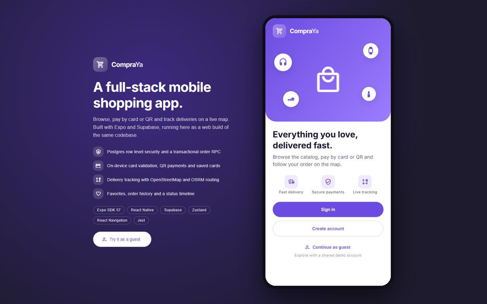

## Screenshots

<p align="center">
  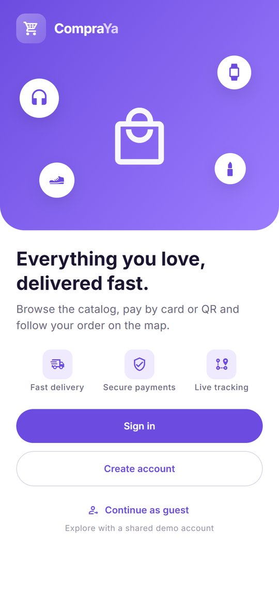
  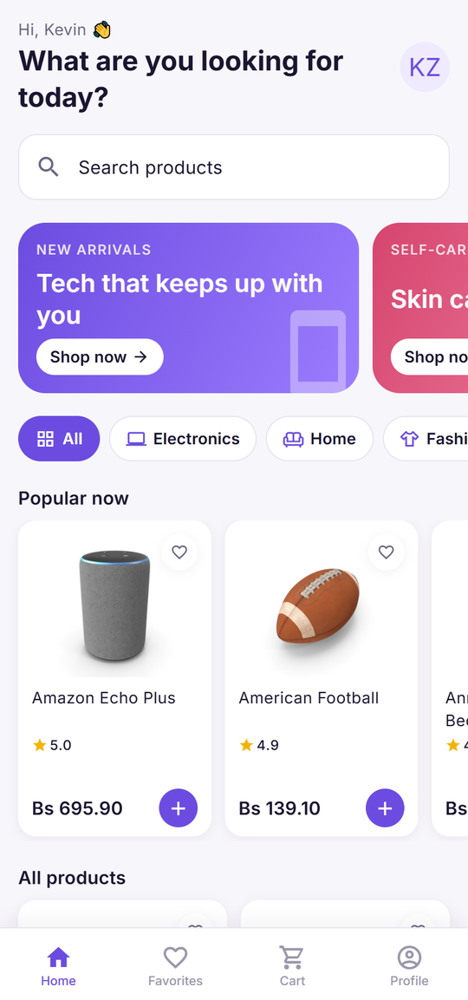
  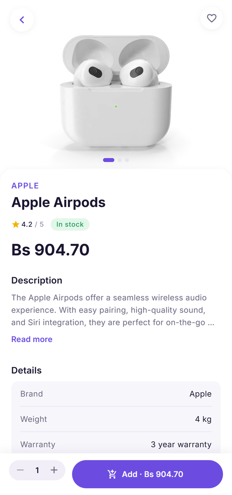
  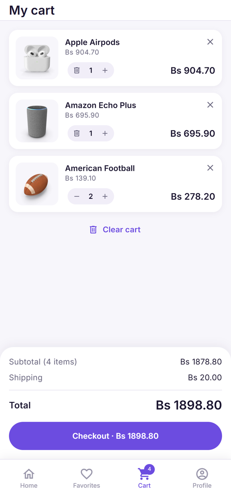
</p>
<p align="center">
  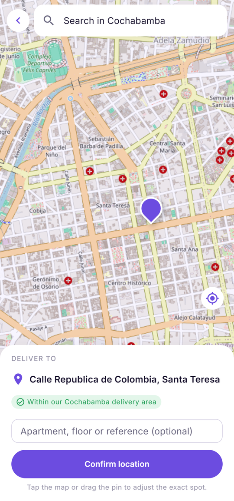
  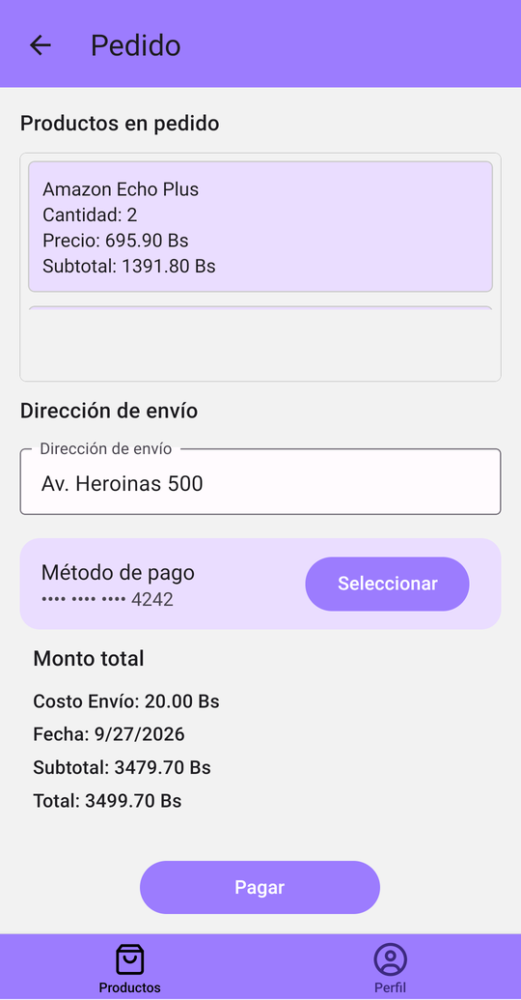
  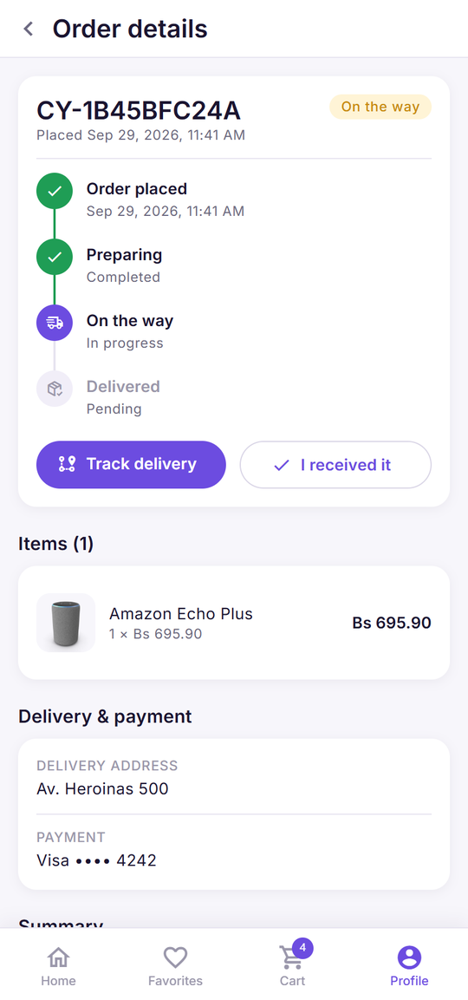
  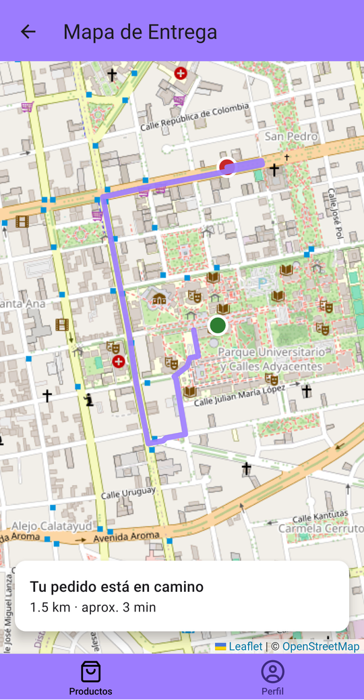
</p>
<p align="center">
  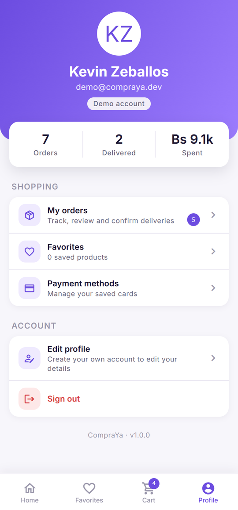
</p>

## Features

- **Authentication**: sign up, sign in, persistent sessions and password reset via an email deep link
  (Supabase Auth). The navigation tree is derived from the auth session.
- **Catalog**: promo banners, category chips, a "Popular now" carousel, a two-column product grid,
  debounced search, skeleton loading and empty/error states.
- **Product detail**: photo gallery, rating, stock status, expandable description, specs, related
  products and a sticky "Add to cart" bar with a quantity stepper.
- **Favorites**: save products with a heart; synced to Supabase with optimistic updates.
- **Cart**: stored on the device (persisted across restarts) with thumbnails and quantity steppers.
- **Checkout**: three steps (address → payment → review) followed by an animated order confirmation.
- **Delivery location on a map**: customers search a place, drop a pin or use their current location
  on a map of Cochabamba; the address is filled in by reverse geocoding. Deliveries are limited to
  10 km around the city center, drawn on the map and enforced again by the database.
- **Payments**
  - Cards are validated on the device (Luhn checksum, brand detection, expiry) with a live card
    preview. **Only the brand and last four digits are stored.**
  - QR payments render a dynamic QR code with the order amount and a unique reference.
- **Orders**: placed atomically by the `create_order` Postgres function, which prices items server-side,
  checks and decrements stock, and stores line items. An orders screen and an order detail with a
  status timeline let customers track and confirm deliveries.
- **Delivery tracking**: route from the store to the delivery address with distance and ETA, using
  **keyless** providers: a Leaflet map with OpenStreetMap tiles, the native geocoder with an
  OpenStreetMap Nominatim fallback, and OSRM routing. No Google Maps API key is needed.
- **Profile**: stats (orders, deliveries, amount spent), saved cards, and editing the name or email
  (confirmed through Supabase Auth).
- **Design system**: shared color, spacing and radius tokens, a custom Material 3 theme, the Inter
  typeface, reusable UI primitives, haptic feedback and branded toasts.
- **Guest mode**: one-tap sign-in with a shared, read-only demo profile.
- **Runs everywhere**: Android and iOS (Expo Go or EAS builds) and the web (static export on Vercel).

## Tech stack

| Area          | Tools                                                                                                             |
| ------------- | ----------------------------------------------------------------------------------------------------------------- |
| App           | Expo SDK 57, React Native 0.86, React 19, React Native Web                                                        |
| Navigation    | React Navigation 7 (native stack + bottom tabs)                                                                   |
| UI            | React Native Paper (Material Design 3, custom theme), Inter, `expo-image`, `expo-linear-gradient`, `expo-haptics` |
| Maps & QR     | Leaflet (in `react-native-webview`), OpenStreetMap, OSRM, `react-native-qrcode-svg`                               |
| State & forms | Zustand (with persistence), React Hook Form, Zod                                                                  |
| Backend       | Supabase: Postgres, Auth, row level security, RPC functions                                                       |
| Quality       | ESLint (`eslint-config-expo`), Prettier, Jest + React Native Testing Library, GitHub Actions                      |
| Delivery      | Vercel (web), EAS Build (Android APK), scheduled Supabase keep-alive                                              |

## Architecture

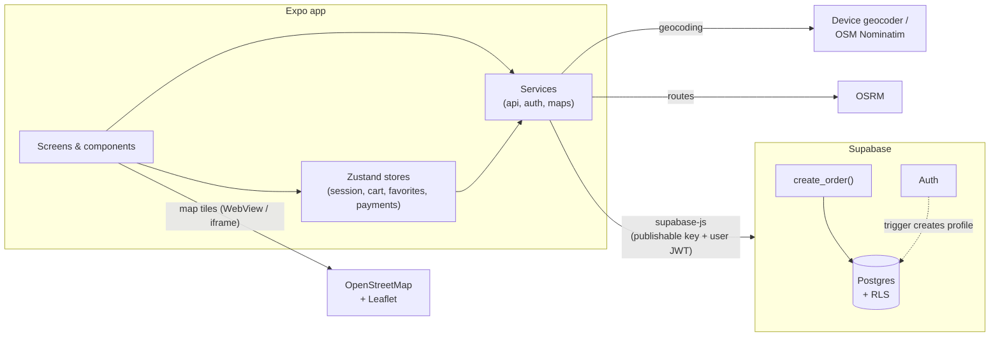

- **Security lives in the database.** The publishable key ships with the app, so every table has RLS:
  the catalog is public, while profiles, payment methods and orders are only visible to their owner.
  Clients can only change an order's status and a profile's name (column-level grants).
- **Orders are created only by `create_order`** (`security definer`), which ignores client prices,
  rejects delivery points outside the delivery area and runs in a single transaction.
- **Profiles are created by a trigger** on `auth.users`, so credentials never touch public tables.

### Data model

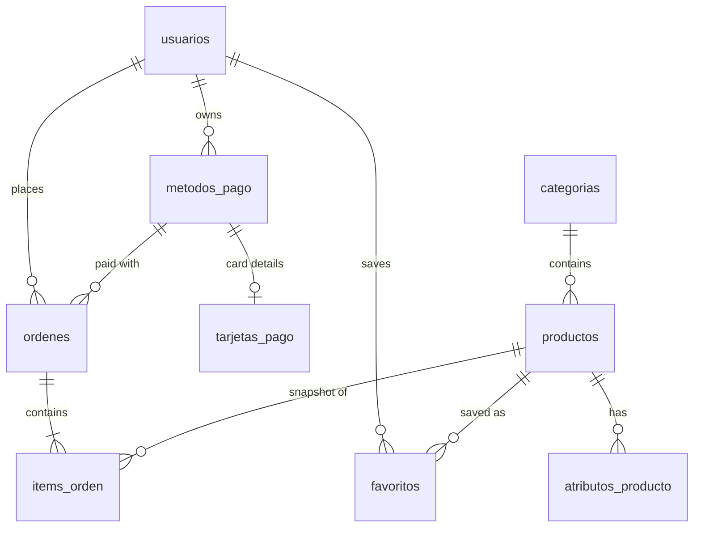

The schema is versioned in [`supabase/migrations`](supabase/migrations) and demo data in
[`supabase/seed.sql`](supabase/seed.sql).

## Getting started

### Prerequisites

- Node.js 24 (see `.nvmrc`)
- A free [Supabase](https://supabase.com) account
- The **Expo Go** app on your phone ([Android](https://play.google.com/store/apps/details?id=host.exp.exponent) / [iOS](https://apps.apple.com/app/expo-go/id982107779))

### 1. Install

```bash
git clone <this-repository-url> compraya
cd compraya
npm install
```

### 2. Create the backend

The Supabase CLI is included as a dev dependency.

```bash
npx supabase login
npx supabase projects create compraya --org-id <your-org-id> --region sa-east-1 --db-password <password>
npx supabase link --project-ref <project-ref>
npx supabase db push --include-seed   # schema, RLS, functions and demo catalog
npx supabase config push              # auth settings (redirect URLs, email confirmation)
```

### 3. Configure the app

```bash
cp .env.example .env
```

Fill in `EXPO_PUBLIC_SUPABASE_URL` and `EXPO_PUBLIC_SUPABASE_KEY` (the **publishable** key from
_Project Settings → API Keys_, or `npx supabase projects api-keys`). Never put secret keys in `.env`:
`EXPO_PUBLIC_*` values are bundled into the app.

Optionally set `EXPO_PUBLIC_DEMO_EMAIL` / `EXPO_PUBLIC_DEMO_PASSWORD` to the credentials of an account
you create for visitors; this enables the **"Continue as guest"** button.

### 4. Run

```bash
npm start
```

Scan the QR code with Expo Go, or press `w` to open the web version. For a card payment you can use
the test number `4242 4242 4242 4242` with any future expiry date. No real payment is processed.

## Deployment (free tiers)

### Web on Vercel

1. Import the repository in [Vercel](https://vercel.com/new). [`vercel.json`](vercel.json) already sets
   the build command (`npm run build:web`), the `dist` output and the single-page rewrite.
2. Add the `EXPO_PUBLIC_*` variables from your `.env` under _Settings → Environment Variables_ and
   deploy.
3. Allow password reset links to return to the site: add your exact URL to `additional_redirect_urls`
   in [`supabase/config.toml`](supabase/config.toml) (for example `"https://your-app.vercel.app/**"`)
   and run `npx supabase config push`.

### Android APK with EAS

```bash
npx eas-cli login
npx eas-cli init                      # links the project to your Expo account
npx eas-cli env:create --environment preview --name EXPO_PUBLIC_SUPABASE_URL --value <url> --visibility plaintext
npx eas-cli env:create --environment preview --name EXPO_PUBLIC_SUPABASE_KEY --value <key> --visibility plaintext
npm run build:android                 # builds an APK in the EAS cloud
```

Add the demo account variables the same way if you want the guest button. Attach the resulting APK to a
[GitHub Release](../../releases/new) so the "Download" link above works.

### Keep the backend awake

Free Supabase projects pause after a week without traffic. The
[keep-alive workflow](.github/workflows/supabase-keep-alive.yml) queries the catalog every three days.
Add the `SUPABASE_URL` and `SUPABASE_PUBLISHABLE_KEY` repository secrets to enable it. GitHub disables
scheduled workflows after 60 days without repository activity, so re-enable it from the _Actions_ tab
if needed.

## Scripts

| Command                 | Description                          |
| ----------------------- | ------------------------------------ |
| `npm start`             | Start the Expo dev server            |
| `npm test`              | Run the Jest test suite              |
| `npm run lint`          | Lint with ESLint                     |
| `npm run format`        | Format the codebase with Prettier    |
| `npm run format:check`  | Check formatting (used in CI)        |
| `npm run build:web`     | Export the static web app to `dist/` |
| `npm run build:android` | Build an Android APK with EAS        |

## Project structure

```
src/
├── components/     Feature components (product card, card preview, order timeline…)
│   └── ui/         Design-system primitives (Screen, Header, Price, Rating, QuantityStepper…)
├── config/         App constants (store location, delivery area)
├── lib/            Supabase client
├── navigation/     Root (auth-gated), auth, tabs and per-tab stacks
├── schemas/        Zod form schemas
├── screens/
│   ├── auth/       Welcome, sign in, register, forgot/reset password
│   ├── shop/       Home, product detail, favorites, cart, checkout, payments, QR, confirmation, map
│   └── profile/    Profile, orders, order detail, edit profile
├── services/       Backend API, auth deep links, maps (geocoding + routing)
├── stores/         Zustand stores: session/user, cart, checkout, favorites, payment methods
├── theme/          Design tokens, Material 3 theme and fonts
└── utils/          Pure helpers (cards, orders, order status, products, retry) — unit tested
supabase/
├── migrations/     Versioned schema, RLS policies and functions
└── seed.sql        Demo catalog
```

## Testing

```bash
npm test
```

70 tests across 17 suites cover card validation, order totals and status timelines, delivery-area
geometry, address labels, form schemas,
password reset links, the cart and favorites stores (including optimistic updates and order placement
through the RPC), request retries and UI components such as the product card, quantity stepper and
checkout summary. Supabase is mocked, so tests run offline. CI runs lint, formatting, tests and an
Android bundle on every push.

## Notes

- Payments are **simulated**: no payment gateway is involved.
- Map tiles, geocoding and routing use OpenStreetMap, Nominatim and OSRM public services, all behind
  `src/services/maps.js` and `src/components/RouteMap.jsx`.

## Author

**Wally Kevin Zeballos Oquendo**

## License

[MIT](LICENSE)
